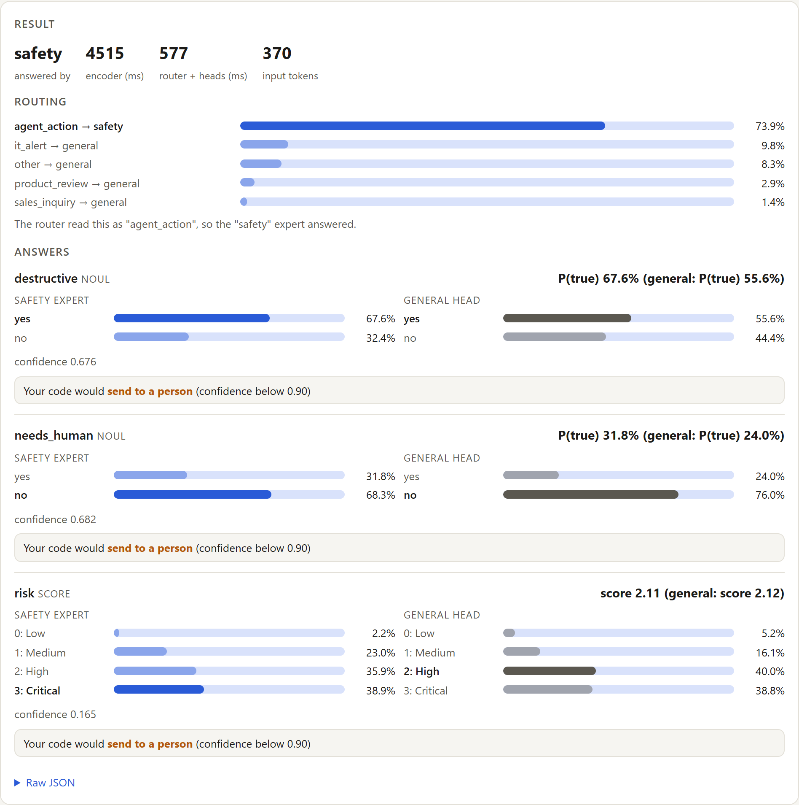
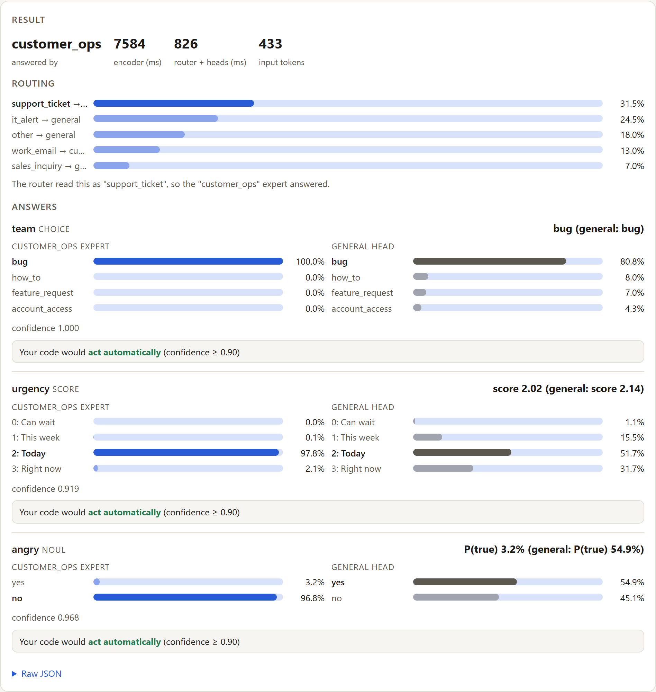
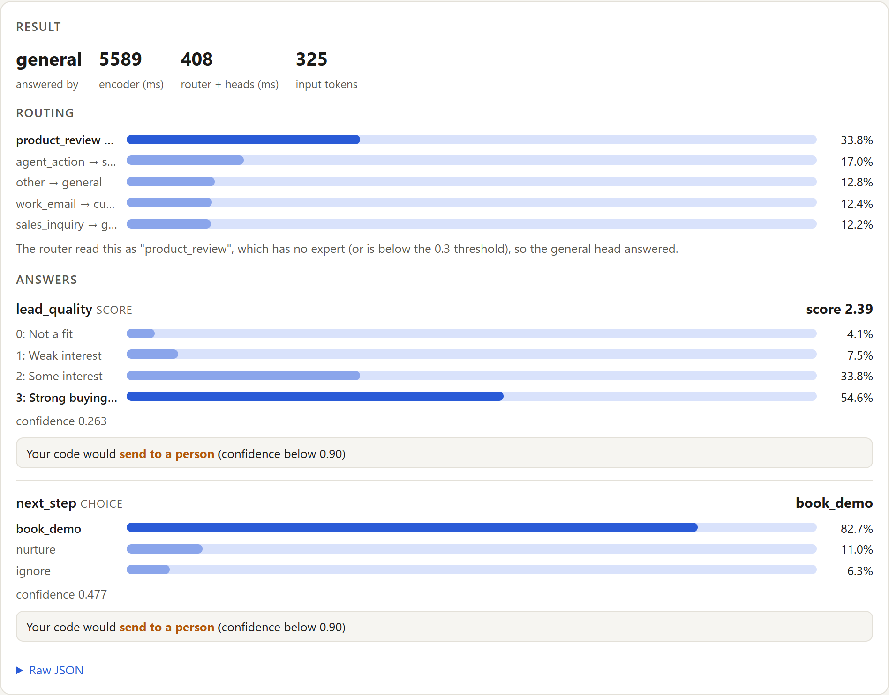
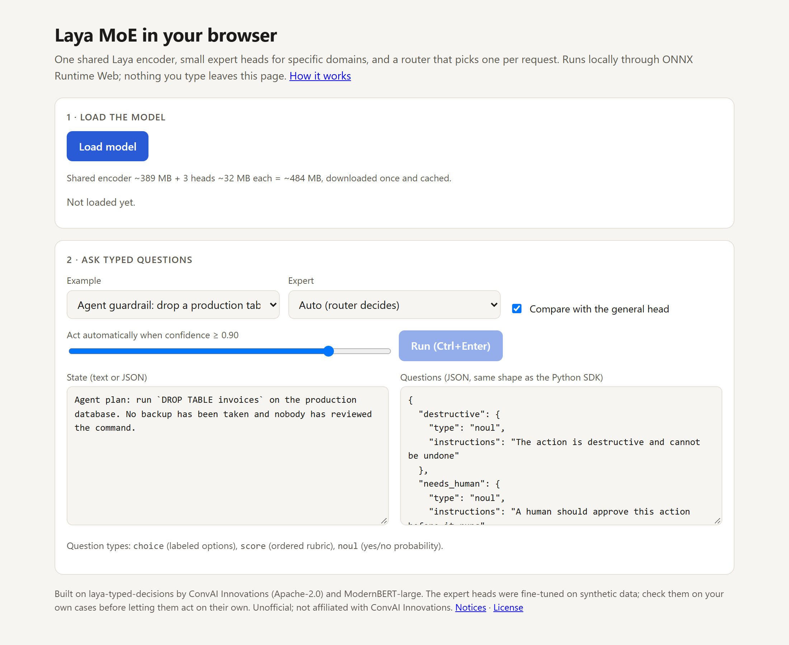
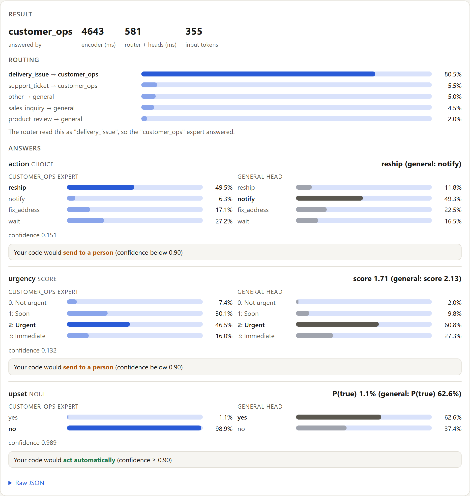

# A mixture of experts for a decision encoder: layaMOE

*Domain experts on top of Laya, trained on a laptop CPU, running in the browser.*

**Live demo:** https://vishalmysore.github.io/layaMOE/ · **Code:** https://github.com/vishalmysore/layaMOE · **Expert heads:** [VishalMysore/layaMOE](https://huggingface.co/VishalMysore/layaMOE) · **Browser build:** [VishalMysore/laya-moe-web](https://huggingface.co/VishalMysore/laya-moe-web)

---

## Starting point: Laya

[Laya](https://huggingface.co/convaiinnovations/laya-typed-decisions) is a decision model, not a chat model. You give it some text and a few typed questions (a *choice* between labeled options, a *score* on an ordered scale, or a *yes/no*), and it answers all of them in one forward pass with calibrated probabilities. It is a ModernBERT-large encoder plus a small two-layer decision head, 421M parameters in total, and small enough to run in a browser tab.

As a general-purpose decision model, `laya-typed-decisions` answers 59.6% of 312 questions correctly on 108 hand-labeled cases across nine domains, with no domain-specific training. The per-domain numbers show where domain experts could add the most:

| Domain | Correct |
|---|---|
| patient messages | 83.3% |
| product reviews | 77.8% |
| content moderation | 75.0% |
| support tickets | 66.7% |
| IT incidents | 61.1% |
| email triage | 52.8% |
| delivery exceptions | 47.2% |
| sales leads | 41.7% |
| **agent guardrails** | **39.6%** |

Agent guardrails, deciding whether an AI agent's planned action is destructive or needs a human, has the most room to grow and is also where extra accuracy is worth the most. Score questions are another opportunity: without domain context the model tends toward the middle of the scale, and it rated the risk of all twelve agent actions "Medium".

One way to specialise it is to fine-tune a copy for each domain, but that means shipping 421M parameters per domain, and a single model fine-tuned on everything risks losing what it already does well. This project tries something in between: keep Laya exactly as it is and add small experts beside it.

## Why not a "real" mixture of experts?

The mixture-of-experts models in the news (DeepSeek-V3, and tutorials like nanoMoE) replace every feed-forward block of a language model with N experts and a per-token router, trained from scratch with load-balancing losses. That design does not fit here:

- Laya is an encoder with a decision head, not a text generator. Per-token experts learn whatever specialisation helps the loss. They do not line up with "safety" or "customer operations", which is the split we actually want.
- N copies of every feed-forward block multiply the download, and ONNX Runtime Web has no sparse MoE kernel, so a browser would compute every expert anyway.

## The design: shared encoder, expert heads, one router

```
             text + typed questions
                      │
          ┌───────────▼────────────┐
          │  ModernBERT encoder    │  395M params, frozen, shared by every expert
          └───────────┬────────────┘
                      │ hidden states (computed once per request)
       router ────────┼──────────────────────┐
                      ▼                      ▼
   ┌──────────┐  ┌──────────────┐  ┌──────────────┐
   │ general  │  │    safety    │  │ customer_ops │   each head: 26.5M params
   │ original │  │ guardrails + │  │ tickets +    │   (type embedding, 2 transformer
   │   head   │  │ moderation   │  │ delivery +   │    layers, scorer)
   └──────────┘  └──────────────┘  │ email        │
                                   └──────────────┘
```

- **The encoder is frozen and shared.** Nothing below the decision head changes, so the domains without an expert keep exactly the behaviour they had.
- **An expert is a copy of Laya's decision head**, fine-tuned for a group of domains. At 26.5M parameters it is about 6% of the model.
- **The router runs once per request, not once per token.** It asks the base model one extra choice question, "What kind of text is this?", and each answer maps to an expert or to the general head.

A quick check before training anything: running the frozen encoder and then a copied head reproduces the original model's logits exactly (maximum difference 0.0). The split is a refactoring, not an approximation.

## Training on a laptop CPU

Because the encoder never changes, its output for each training example only has to be computed once. `cache_features.py` runs the encoder over every (text, question) pair and stores the hidden states in fp16 (they differ from fp32 by 3e-4). `train_expert.py` then trains only the head on those cached features. There is no GPU anywhere in this project.

**Data.** There is no public dataset of labeled agent actions, so `gen_train_data.py` builds synthetic cases from slots. For guardrails the slots are the action (read, write, delete, send, change a security setting, move money), the environment (production, staging, sandbox), and the safety net (a verified backup, versioning, `--dry-run`, or nothing). Each label is computed from the slots by an explicit rule: for example, "DELETE on production with no backup" is destructive, needs a human, and is critical risk, and the same command with `--dry-run` is safe. Question wordings are paraphrased and choice options are shuffled, so an expert learns the domain rather than one prompt. That gives 500 cases per domain and about 8,500 question items in total. Any generated case that shares a five-word sequence with an evaluation case is dropped.

**Loss.** Cross-entropy, plus a ranked-probability term on score questions. The ranked-probability term penalises probability mass that sits far from the right level, which pushes the expert away from the middle of the scale when the text calls for an extreme.

**One lesson.** The head needs a much higher learning rate than full fine-tuning would. At 3e-5 it barely moved (validation 58% → 59% after four epochs), and I briefly suspected a bug. An overfitting test on 64 examples settled it: at 3e-4 the head fits them to 95% within 40 steps. The final runs use 6e-4 for six epochs:

| Expert | Train / val items | Base head | Expert | CPU time |
|---|---|---|---|---|
| safety | 3,120 / 380 | 58.4% | 73.4% | ~45 min |
| customer_ops | 4,011 / 489 | 57.3% | 75.9% | ~100 min |

(These numbers are on held-out *synthetic* data. The real test is below.)

## The router, twice

The first router asked the base model which expert should answer, with three broad options ("an AI agent's action or a comment to moderate", "a support ticket, delivery problem or work email", "anything else"). It performed badly: 9 of 12 guardrail cases went to the general head, and half of the patient messages went to customer_ops, which made them worse.

The fix was to ask a question the model is good at: what kind of text this is, from ten concrete kinds (agent action, public comment, support ticket, delivery issue, work email, IT alert, patient message, product review, sales inquiry, other). A fixed table maps each kind to an expert or to the general head. With that change, guardrails reach the safety expert 12 times out of 12, and patient messages and IT alerts stay on the general head 12 times out of 12.

The router can be seen at work in the demo. For an agent action it reads "agent_action" at 74%:



## Results

Evaluation uses the 108 hand-labeled cases (312 answers), none of which were used for training. Each question gets three answers: **general** is the original head, **oracle** is the expert that owns the domain (the result a perfect router would give), and **moe** is what the router actually picked.

| Domain | general | oracle | moe |
|---|---|---|---|
| agent guardrails | 39.6% | 66.7% | **66.7%** |
| content moderation | 75.0% | 83.3% | 75.0% |
| delivery exceptions | 47.2% | 63.9% | **63.9%** |
| email triage | 52.8% | 58.3% | 50.0% |
| support tickets | 66.7% | 80.6% | **83.3%** |
| four domains without an expert | 66.7% | | 66.7% |
| **All** | **59.6%** | 68.9% | **67.3%** |

Most of the gain is on score questions (41.7% → 59.4%) and yes/no questions (68.3% → 78.3%). Choice questions got slightly worse (66.7% → 61.5%), mainly on email and moderation cases that were routed to the wrong head. The four domains with no expert are unchanged, which is the point of keeping the original head.

In the support-ticket example below, the expert is sure it is a bug, due today, and that the customer is not angry. The general head put 55% on "angry" for a calm message.



When the input fits no expert, the general head answers as before:



## In the browser

`export_web.py` exports the encoder and each head as separate ONNX graphs with weight-only int8 quantization: a 390 MB encoder and a 32 MB file per head, split into 24 MB parts with SHA-256 hashes and hosted on Hugging Face. The page runs them with ONNX Runtime Web on WASM. It downloads everything once, caches it in the browser, and then works offline. Nothing typed into the page leaves the machine.

Because the graphs are split, one encoder pass covers the router question and all of the user's questions together. The heads are cheap after that, so the "compare with the general head" view costs about 0.3–0.6 s extra rather than a second full run. With three questions on four WASM threads, a request takes about 4–5 s for the encoder and under 1 s for the router and heads.



Quantization does not cost accuracy on the evaluation set. Run through the same int8 files the page uses, the MoE scores 67.9% (67.3% in PyTorch), the general head scores 58.7% (59.6%), and routing matches PyTorch on every case.

## Limits

- **Small evaluation.** There are only 12 cases per domain, so one case is three or four answers and per-domain differences under about 10 points are noise.
- **The router was designed after seeing the eval set.** Its list of kinds was written once, after the first router failed there. The descriptions are generic and nothing was tuned per case, but this is still a look at the test set.
- **Synthetic training data.** Template data teaches the rules I wrote down, including my blind spots.
- **The experts can be confidently wrong.** This case from the demo shows it:

  

  The customer has written three times about a parcel that has not moved in 12 days. The expert says "not upset" with 98.9% confidence and would act automatically. A similar hand-labeled case is marked "upset". The synthetic data only marked customers as upset when they used angry words, and the expert learned exactly that rule. Fine-tuning made this answer more confident, not more correct.

- **Some answers are still weak where they matter most.** For `DROP TABLE` on production with no backup, the safety expert says destructive at 68% but "needs a human" at only 32%.

The confidence values are still useful, but they need checking on your own data before a threshold is trusted, and a person should stay in the loop.

## What's next

- Train the router instead of prompting it. Moderation and email are the domains it routes worst.
- Use more varied training data, with labels that don't depend on surface wording. The "upset" example above shows why.
- Try LoRA on the top encoder layers on a GPU. Training only the head was still improving at epoch 6, and there is headroom left.
- Add more experts, starting with IT incidents and sales leads.

## Try it

- Demo: https://vishalmysore.github.io/layaMOE/ (downloads about 490 MB once, then runs offline; Chrome or Edge recommended)
- Reproduce: see the [README](../README.md). Everything runs on a CPU: `gen_train_data.py`, `cache_features.py`, `train_expert.py`, `eval_moe.py`, `export_web.py`.

*Built on laya-typed-decisions by ConvAI Innovations and ModernBERT-large by Answer.AI and LightOn (both Apache-2.0). Unofficial and not affiliated with ConvAI Innovations.*
