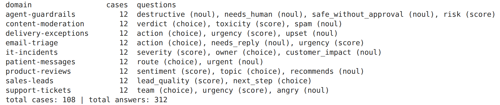
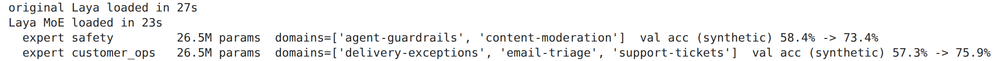
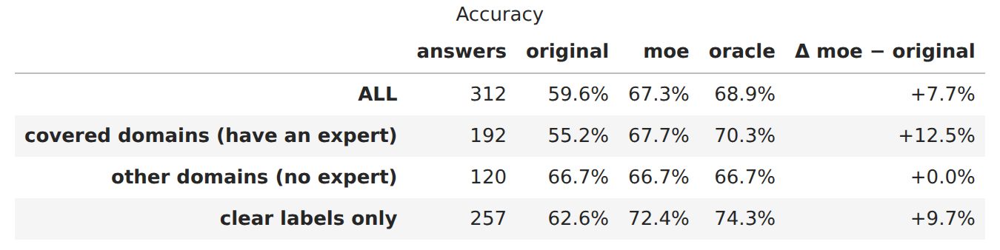
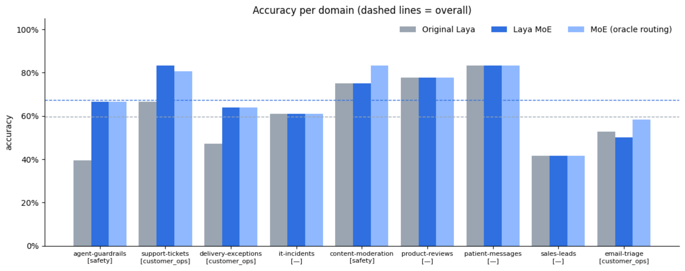
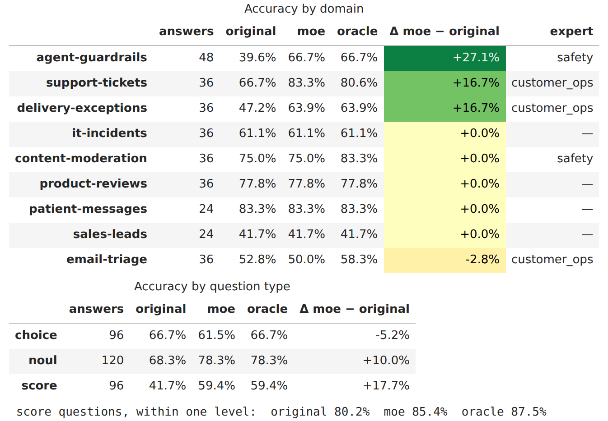
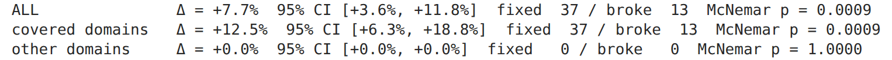
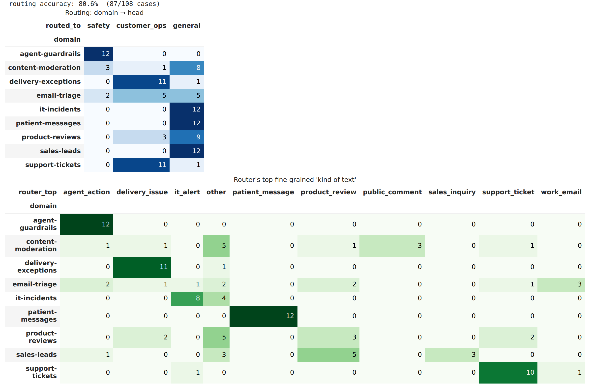
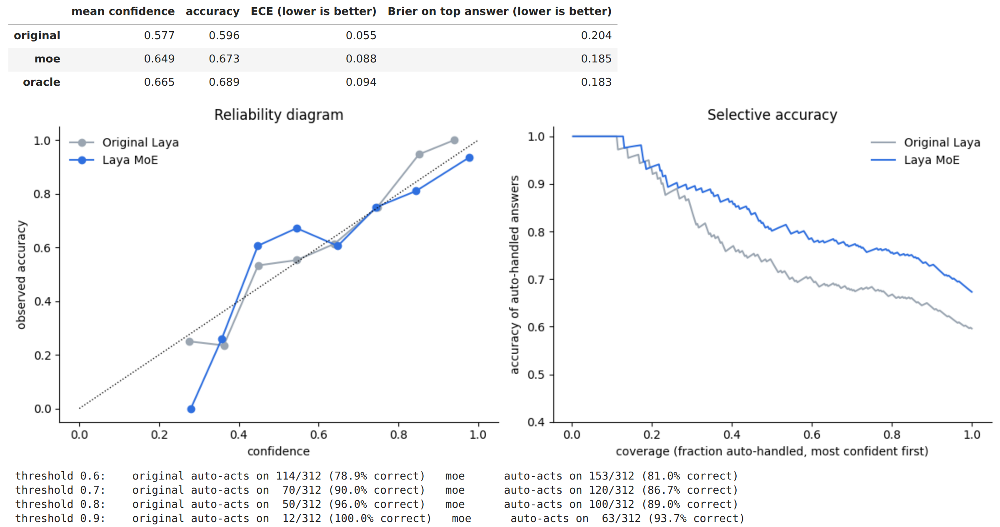
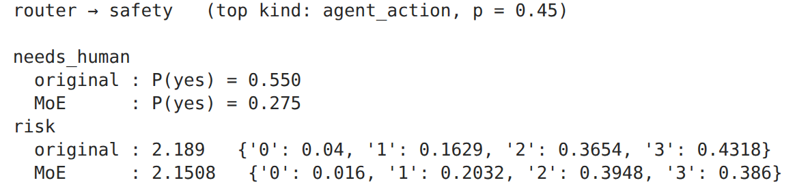

# Laya Vs Jev - Laya Deep Dive

*How two "System 1" decision models work, where they differ, and how a small mixture of experts (MoE) built on top of Laya changes its benchmark numbers, with every result reproduced from a public notebook.*

**Code:** [github.com/vishalmysore/layaMOE](https://github.com/vishalmysore/layaMOE) · **Notebook:** [laya_vs_moe_comparison.ipynb](https://colab.research.google.com/github/vishalmysore/layaMOE/blob/main/notebooks/laya_vs_moe_comparison.ipynb) · **Live demo:** [vishalmysore.github.io/layaMOE](https://vishalmysore.github.io/layaMOE/)

---

## TL;DR

- **Laya** and **Jev** are *decision models*: you send text plus typed questions (**choice**, **score**, **yes/no**) and get back one probability distribution per question, with no text generation.
- **Jev** is a hosted model with closed weights and a long context. **Laya** is an open ModernBERT-large encoder with a small decision head, and because the weights are open you can take it apart.
- On the published typed-decisions benchmark the fine-tuned Laya checkpoint is ahead on accuracy and Brier score, while Jev is ahead on calibration error and on questions with very many labels.
- The second half of this article is about **layaMOE**, a mixture of experts I built on Laya: one frozen shared encoder, two small expert heads, and a router. Re-running the comparison notebook gives **67.3% vs 59.6%** for the original Laya on 312 hand-labeled answers (+7.7 points, 95% CI +3.6 to +11.8, McNemar p = 0.0009), with **no change** on domains that have no expert.

---

## What is a decision model?

A large language model answers an operational question such as "route this ticket" or "is this agent action safe?" by *writing* an answer token by token. Your code then has to parse that text, validate it against a schema, retry when the JSON is broken, and deal with answers that are not on the list.

A **decision model** removes that loop. It takes:

- a **state**: the text (or JSON) being judged, and
- one or more **typed questions**, each with the options defined at request time,

and returns a probability for every allowed option in a single forward pass. Three question types cover most workflow decisions:

| Type | What it answers | What comes back |
|---|---|---|
| **choice** | Pick one label from a list (billing / support / sales) | a probability per option, plus the top option |
| **score** | Place the text on an ordered scale (Low → Critical) | a probability per level, plus the expected level |
| **noul** (yes/no) | Is this statement true? ("needs a human") | one probability that it is true |

The model can't answer outside the options you declared. It can still pick the *wrong* option inside that list, and that is why calibration matters: across many answers given at 80% confidence, about 80% should be correct, so downstream code can act automatically above a threshold and escalate below it. This "fast, intuitive judgement with an honest confidence" is what both projects call a **System 1** model.

## How Jev works

Jev is a hosted decision model with closed weights, served through an API. From its public documentation and third-party write-ups:

- **Request shape.** A request carries a `state` (text, a JSON object or an array) and a `questions` map. Each question has a `type` (`choice`, `score`, `noul`), `instructions`, and `criteria` (an option dictionary or a list of levels). All questions are answered from the same evaluation of the state, not as separate calls.
- **Restricted softmax.** Public explanations describe the core idea as reading the logits for *only the declared answer options* and applying a softmax over those few entries, instead of a softmax over a whole vocabulary repeated token after token. One pass gives a full distribution over the allowed answers.
- **Outputs.** Choice returns the selected option, a probability per option and a confidence value. Score returns a probability-weighted average position, a probability per level, and confidence (scales go up to 10 levels). Noul returns a single probability.
- **Confidence vs correctness.** Jev's documented *confidence* measures how concentrated the distribution is. It says nothing about whether the answer is right. Calibration, i.e. whether 0.8 really means 80% correct, is a separate property measured over many answers.
- **Training.** Jev is described as trained with *reinforcement learning for calibrated decisions* (RLCD). The details are not published.
- **Context.** Jev documents a long input context (around 32K tokens of state plus questions), so whole documents can go in without chunking.
- **Limits.** Text only, no generation or explanations, weak at multi-step hidden reasoning, arithmetic or date math, and sensitive to irrelevant context. Splitting a hard decision into several small questions works better.

## How Laya works

Laya ([model card](https://huggingface.co/convaiinnovations/laya-typed-decisions)) exposes the same three question types and a compatible `system_one` request and response shape, but the weights are open (Apache-2.0), so every layer can be inspected:

```
[CLS] <type> question [SEP] [MASK] option1 [MASK] option2 … [SEP] state [SEP]
          │
   ModernBERT-large encoder (395M)
          │ hidden states
   + type embedding (choice / score / noul)
          │
   2 transformer layers  ("decision head")
          │
   scorer at each option's [MASK] position → one logit per option
          │
   softmax over this question's options, divided by a fitted temperature
```

- **Options live in the input.** Each option gets its own `[MASK]` marker, and the scorer reads a logit at every marker. A new label set needs no retraining, only a new request. It also explains a known limit: all options share a fixed token budget in the head (about 256 tokens), so with dozens of labels each one gets only a few tokens. Laya's own guidance is to keep choice questions under about 20 options.
- **421M parameters in total.** A 395M encoder plus a head of about 26.5M parameters (type embedding, two transformer layers, scorer). That split is what the MoE in the second half uses.
- **Training (RLCD).** Exploration adds zero-mean Gaussian noise to the logits, and the reward is a *strictly proper scoring rule*: log plus spherical score, plus the ranked probability score for ordinal questions. The expected reward is highest only when the model reports its true belief, which pushes it toward honest probabilities. Updates use REINFORCE with a group-mean baseline plus a soft cross-entropy term against teacher distributions.
- **Post-hoc temperature.** Temperatures are fitted per question type and per option count and applied before the softmax.
- **Context.** 1,024 tokens for `laya-typed-decisions` (512 for the base English checkpoint). There is also a multilingual variant for longer inputs.

### Laya vs Jev: technical comparison

| | Laya | Jev |
|---|---|---|
| Weights | Open (Apache-2.0) | Closed, hosted API |
| Architecture | ModernBERT-large encoder + 2-layer decision head, option `[MASK]` scoring | Not published. Described as a restricted softmax over declared option logits |
| Question types | choice, score, noul | choice, score, noul |
| Training objective | RLCD with strictly proper scoring rules (published) | RLCD (details not published) |
| Context | 1,024 tokens (typed-decisions) | ~32K input tokens |
| Many-label choice | Weak past ~20 options (fixed head budget) | Strong |
| Runs where | Your CPU or GPU, or a browser tab (ONNX Runtime Web) | Provider's cloud |

### Published benchmark numbers

The only head-to-head numbers are on Laya's model card, where the Jev figures are third-party published with different sample sizes and prompts, so treat them as indicative:

| typed-decisions benchmark | Laya (fine-tuned checkpoint) | Jev 1.13 |
|---|---|---|
| Accuracy | **0.766** | 0.727 |
| Soft accuracy | 0.471 | **0.580** |
| Brier score (lower is better) | **0.062** | 0.148 |
| ECE, calibration error (lower is better) | 0.213 | **0.144** |
| Score MAE (lower is better) | **0.242** | 0.391 |
| Banking77 accuracy (77 labels) | 0.425 | **0.870** |

On short, schema-shaped payloads the fine-tuned Laya checkpoint is competitive or better on hard accuracy. Jev is better calibrated out of the box, spreads probability more usefully (soft accuracy), and handles many-label classification far better. One more point from Laya's own card: the *base* checkpoint is close to chance zero-shot (0.362 vs a 0.318 random baseline). Its strength comes from specialisation, and that is where the rest of this article goes.

---

## Laya deep dive: building a mixture of experts (layaMOE)

Laya needs specialising to be good at a domain, but fine-tuning a separate 421M-parameter copy per domain is heavy, and one model fine-tuned on everything risks losing what it already does well. Because Laya's weights are open, there is a third option: **keep the encoder frozen and add small experts beside the original head.**

### Why not a "classic" MoE?

The mixture-of-experts language models in the news replace every feed-forward block with N experts and a per-token router, trained from scratch with load-balancing losses. That is the wrong fit for Laya:

- Laya is an encoder with a decision head, not a generator. Per-token experts learn whatever specialisation reduces the loss, and those don't line up with business domains like "safety" or "customer operations".
- N copies of every feed-forward block multiply the download, and a browser runtime has no sparse MoE kernel, so every expert would be computed anyway.

### The layaMOE architecture: sequence-level routing over expert heads

```
             text + typed questions
                      │
          ┌───────────▼────────────┐
          │  ModernBERT encoder    │  395M params, frozen, shared
          └───────────┬────────────┘
                      │ hidden states
       router ────────┼──────────────────────┐
                      ▼                      ▼
   ┌──────────┐  ┌──────────────┐  ┌──────────────┐
   │ general  │  │    safety    │  │ customer_ops │   each head: 26.5M params
   │ original │  │ guardrails + │  │ tickets +    │
   │   head   │  │ moderation   │  │ delivery +   │
   └──────────┘  └──────────────┘  │ email        │
                                   └──────────────┘
```

1. **Frozen, shared encoder.** Nothing below the head changes, so domains without an expert behave exactly as before.
2. **An expert is a copy of Laya's decision head** (type embedding, two transformer layers, scorer), fine-tuned for a group of domains. At 26.5M parameters it is about 6% of the model. Splitting the model this way is exact: frozen encoder plus copied head reproduces the original logits with a maximum difference of 0.0.
3. **A router that asks Laya a question it is good at.** Instead of "which expert?", the router asks one choice question, *"What kind of text is this?"*, over ten concrete kinds (agent action, public comment, support ticket, delivery issue, work email, IT alert, patient message, product review, sales inquiry, other). A fixed table maps each kind to an expert. Anything unmapped, or below a 0.3 probability threshold, falls back to the **general** (original) head.
4. **Per-expert calibration.** Each expert gets its own fitted temperatures per question type and option count.

The core routing logic in [`laya_moe/moe.py`](../laya_moe/moe.py) is only a few lines:

```python
ROUTER_EXPERTS = {"agent_action": "safety", "public_comment": "safety",
                  "support_ticket": "customer_ops", "delivery_issue": "customer_ops",
                  "work_email": "customer_ops"}

def route(self, state):
    a = self.base.system_one(state, {"route": self.router_q})["answers"]["route"]
    probs = a["probabilities"]
    top = max(probs, key=probs.get)
    exp = ROUTER_EXPERTS.get(top)
    chosen = exp if (exp in self.experts and probs[top] >= self.threshold) else "general"
    return chosen, {"probabilities": probs, "top": top, "confidence": a["confidence"]}
```

### Training the experts on a laptop CPU

Because the encoder is frozen, its hidden states for each training example are computed once and cached. Only the 26.5M-parameter head is trained on those cached features. No GPU was used. Training data is synthetic and rule-labeled: cases are built from slots (action, environment, safety net, tone, deadline and so on), and each label is computed from the slots by an explicit rule. Question wordings are paraphrased and options shuffled, so an expert learns the domain rather than one prompt. Any generated case that shares a five-word sequence with an evaluation case is dropped. The loss is cross-entropy plus a ranked-probability term on score questions. The head needed a much higher learning rate than a full fine-tune (6e-4 rather than 3e-5).

## Running the benchmark: original Laya vs Laya MoE

For this article I re-ran the public comparison notebook end to end, unchanged, on a 2-vCPU Linux machine in fp32 with PyTorch on CPU. It loads the original `laya-typed-decisions` with the official `laya` package and the MoE expert heads from Hugging Face, then runs both on **108 hand-labeled cases across 9 domains (312 answers)**. None of these cases were used in training.

The evaluation set and its typed questions:



Both models load from Hugging Face. Each expert is 26.5M parameters, and on held-out synthetic data the heads improved from 58.4% → 73.4% (safety) and 57.3% → 75.9% (customer_ops):



### Sanity check: is it apples to apples?

When the router sends a case to `general`, the MoE uses the untouched base head, so its answers must equal the original Laya's. They do, on all 156 such answers:


### Headline accuracy



- **Overall:** 59.6% → **67.3%** (+7.7 points).
- **Domains that have an expert:** 55.2% → **67.7%** (+12.5 points).
- **Domains with no expert:** 66.7% → 66.7%. Nothing got worse.
- **Oracle routing** (the owning expert always answers) reaches 68.9%, so routing mistakes cost only about 1.6 points overall.

### Per-domain and per-question-type results





- **Agent guardrails** gets the biggest gain, +27.1 points (39.6% → 66.7%). That is Laya's weakest domain and the one where mistakes cost the most.
- **Support tickets** and **delivery exceptions** each gain +16.7 points.
- By question type, **score** questions improve the most (41.7% → 59.4%, and 80.2% → 85.4% within one level). Without domain context the base head drifts to the middle of the scale, and it rated all twelve agent actions "Medium" risk. **Yes/no** goes from 68.3% to 78.3%.
- **Choice** questions get slightly worse (66.7% → 61.5%), almost entirely from email-triage and moderation cases sent to the wrong head.

### Is the gain statistically real?

Both models answer the same 312 questions, so the notebook uses paired tests: McNemar's exact test on answers only one model got right, and a paired bootstrap over *cases* (answers within a case are correlated).



The MoE fixes 37 answers and breaks 13. The 95% confidence interval on the gain (+3.6 to +11.8 points) excludes zero, and McNemar p = 0.0009.

### Router behaviour



The router sends cases to the correct head 80.6% of the time (87 of 108). Agent guardrails, IT incidents, patient messages and sales leads are routed perfectly, and support tickets and delivery exceptions are 11 of 12. The weak spots are clear: **content moderation** (8 of 12 go to general, mostly read as "other") and **email triage** (split across heads). Those two account for most of the gap to the oracle and for the drop on choice questions.

### Calibration and confidence gating

A System 1 model is only useful as a gate if its confidence can be trusted, so accuracy alone isn't enough:



This part is mixed:

- **Selective accuracy improves across the board.** At any coverage level, the most confident MoE answers are more often right than the most confident original answers (the blue curve sits above the grey one). The Brier score on the top answer drops from 0.204 to 0.185.
- **Calibration error goes up slightly** (ECE 0.055 → 0.088). The experts are more confident, and not all of that confidence is earned.
- **At high thresholds the trade-off shows.** At 0.9 the original auto-acts on only 12 of 312 answers (all correct), while the MoE auto-acts on 63 (93.7% correct). The MoE takes five times as many decisions off a human's plate, but some of them are wrong, so thresholds must be validated on your own data.

### Laya MoE vs the published Laya benchmark

How do these results relate to the Laya vs Jev table above?

| | Metric | Number |
|---|---|---|
| Laya model card, typed-decisions (4 synthetic workflows) | accuracy | 0.766 (Jev 0.727) |
| This eval, original `laya-typed-decisions` (9 new domains) | accuracy | 0.596 |
| This eval, **Laya MoE** | accuracy | **0.673** |
| This eval, Laya MoE with oracle routing | accuracy | 0.689 |

The published 0.766 was measured on the four workflows that checkpoint was fine-tuned on. On nine domains it was *not* fine-tuned for, the same checkpoint drops to 0.596, which shows how much Laya depends on specialisation. Two small expert heads and a prompted router recover about half of that gap (to 0.673) without touching the encoder and without hurting the domains that have no expert. The two evaluations use different cases and domains, so the numbers show a direction, not a like-for-like ranking. No Jev figures were measured on this eval set.

### Speed

In this PyTorch run (2 vCPUs, fp32), a case took 684 ms with the original Laya and 1,304 ms with the MoE. That is expected, because the Python reference path runs the encoder twice: once for the router question and once for the answers. The browser build removes that cost by running one encoder pass for the router and all questions together, then running the small heads on the same hidden states. There, the int8 MoE scores 67.9%, and routing matches PyTorch on every case.

### Try your own text

The notebook ends with a cell for your own inputs. For an agent plan to rotate a production TLS certificate during business hours, the router picks the safety expert, which is less sure than the base head that a human must approve:



## What I learned building a Laya mixture of experts

1. **Route on what the base model already knows.** A router asking "which expert?" with three broad options failed badly. Asking "what kind of text is this?" over ten concrete kinds worked.
2. **Head-only experts are cheap and safe.** 26.5M parameters per domain group, trained on a CPU, and domains without an expert keep their exact behaviour.
3. **Specialisation raises confidence faster than correctness.** Expect to refit temperatures and validate thresholds on real traffic.
4. **The next gains are in the router and the data.** Training the router instead of prompting it would fix moderation and email routing, and more varied labels would stop experts learning surface rules. For example, one delivery case was marked "not upset" at 99% because the synthetic data only marked angry wording as upset.

## FAQ

**What is the difference between Laya and Jev?**
Both are decision models that answer choice, score and yes/no questions with probabilities in one forward pass. Laya is open (a ModernBERT-large encoder with a decision head) and runs on your own hardware or in a browser. Jev is a closed hosted model with a much longer context and stronger many-label classification.

**Is Laya more accurate than Jev?**
On the published typed-decisions benchmark the fine-tuned Laya checkpoint scores 0.766 accuracy vs 0.727 for Jev, while Jev has lower calibration error (0.144 vs 0.213) and far higher Banking77 accuracy (0.870 vs 0.425). The two are strong in different places.

**What is a Laya mixture of experts (MoE)?**
layaMOE keeps Laya's encoder frozen and adds small, domain-specific copies of its decision head, plus a router that picks one per request. On 312 hand-labeled answers it scores 67.3% vs 59.6% for the original Laya.

**Can Laya run in a browser?**
Yes. The layaMOE demo runs the encoder and expert heads with ONNX Runtime Web (int8, WebAssembly) entirely in the browser tab.

**How do I reproduce these results?**
Open the [Colab notebook](https://colab.research.google.com/github/vishalmysore/layaMOE/blob/main/notebooks/laya_vs_moe_comparison.ipynb) and run all cells. It needs a CPU runtime and no API keys. An executed copy with all outputs is at [`notebooks/laya_vs_moe_comparison_executed.ipynb`](../notebooks/laya_vs_moe_comparison_executed.ipynb).

---

## Disclaimer

The layaMOE results in this article come from one controlled run of the public comparison notebook on a 2-vCPU CPU machine (PyTorch, fp32). Accuracy is measured on a small hand-labeled evaluation set (108 cases, 312 answers across 9 domains, labeled by the author and not independently reviewed). With 12 cases per domain, per-domain differences under about 10 points are within noise. The router's list of text kinds was written after an earlier router failed on this same evaluation set, which is a look at the test data. The expert heads were trained on synthetic, rule-generated data, and they can be confidently wrong.

Laya and Jev benchmark figures are quoted from Laya's public model card, where the Jev numbers are themselves third-party published, measured with different samples and prompts. Jev's technical description is based on public documentation and third-party write-ups, because its weights and training details are not published. No Jev results were measured on the layaMOE evaluation set. All figures are experimental observations under specific configurations, not production guarantees. Validate on your own data and keep a human in the loop for consequential decisions.

layaMOE is an independent, unofficial project built on `laya-typed-decisions` (Apache-2.0, ConvAI Innovations) and ModernBERT-large (Apache-2.0). It is not affiliated with or endorsed by ConvAI Innovations or TypeSafe AI. All product names belong to their respective owners. The code, data generator, evaluation scripts and notebook are open source, and independent replication and review are welcome.

**Sources:** [laya-typed-decisions model card](https://huggingface.co/convaiinnovations/laya-typed-decisions) · [Laya on GitHub](https://github.com/NandhaKishorM/laya) · [What Is Jev? (OpenRouter)](https://openrouter.ai/blog/insights/what-is-jev/) · [Jev: inside TypeSafe AI's System One decision model (Hyperstack)](https://www.hyperstack.cloud/technical-resources/tutorials/jev-inside-typesafe-ais-first-system-one-decision-model) · [layaMOE](https://github.com/vishalmysore/layaMOE)
