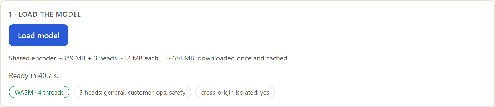
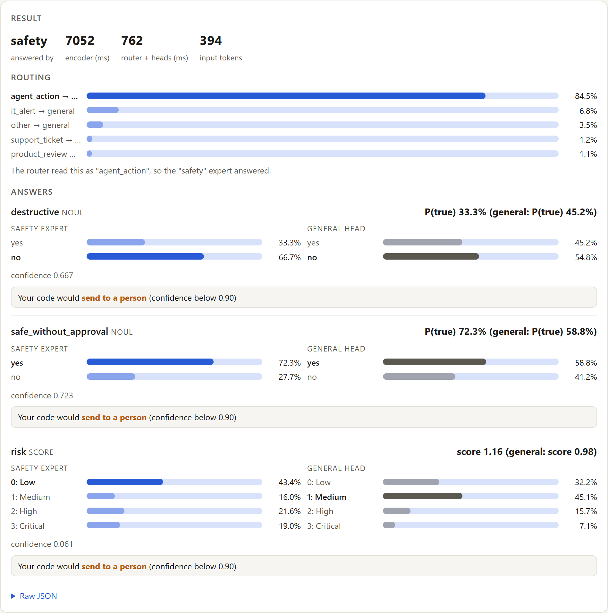

# What Is Laya? Laya vs Jev, with Live Demo!!

**Laya** is an open-source, non-autoregressive **decision model**: a 421M-parameter ModernBERT-large encoder with a typed decision head that answers **choice**, **score** and **yes/no (noul)** questions about a text in a single forward pass and returns calibrated probabilities instead of generated text. **Jev** by TypeSafe AI is a closed decision-model API built around the same three question types. This article explains how decision models work, compares Laya and Jev on published benchmarks, latency, calibration and cost, and shows Laya running entirely in the browser with ONNX Runtime Web and WebAssembly, including a mixture-of-experts version.

**Live demo, no server, no API key:** https://vishalmysore.github.io/layaMOE/

---

## Decision models vs generative LLMs

A generative LLM answers an operational question (route this ticket, flag this action, rate this complaint) by producing text token by token. The label then has to be extracted from that text, which brings output parsing, schema validation, retries on malformed JSON, and answers outside the allowed set.

A **decision model** takes the text (the *state*) and a set of *typed questions*, and returns one probability distribution per question over the options you defined:

- **Choice**: one label from a list supplied at request time, for example routing an email to *billing*, *support* or *sales*.
- **Score**: a level on an ordered scale, for example customer frustration from one to five, returned as per-level probabilities plus an expected score.
- **Noul**: a yes/no statement, returned as the probability that it holds.

There is no generation loop, no text to parse, and no way to answer outside the defined options. All questions about one input are answered in a single forward pass.

**Calibration.** A decision model is trained to report probabilities that match observed frequencies: across many answers given at 80%, about 80% should be correct. Calibration is a property measured over many answers, not a guarantee for a single one, and it has to be checked on the target data (see Laya's limits below). Downstream code can then branch on the probability, acting automatically above a threshold and escalating to a person below it.

## Jev

**Jev** (TypeSafe AI) is a proprietary decision-model API with closed weights, answering choice, score and yes/no questions. Laya's model card lists its price as **$0.042 per million input tokens**. Independent benchmarks cited there ([AbdelStark](https://github.com/AbdelStark/jev-benchmarks), [nibzard](https://github.com/nibzard/decision-model-benchmark)) measured a p50 latency of **236–276 ms** per call.

## Laya

**[Laya](https://huggingface.co/convaiinnovations/laya)** (Convai Innovations) is an open decision model released under **Apache-2.0**, available on Hugging Face and PyPI (`pip install laya`) for self-hosting.

- **Architecture:** a ModernBERT-large encoder (395M) plus a decision head: two transformer layers, a type embedding per question type, and a scorer that rates each option at its own `[MASK]` marker, followed by a softmax over that question's options. That is **421M parameters** in total. A **322M** multilingual variant on mmBERT-base covers 100+ languages.
- **Input format:** `[CLS] <type> question [SEP] [MASK] option1 [MASK] option2 … [SEP] state [SEP]`. The options are part of the input, so a new schema needs no retraining.
- **Training:** reinforcement learning against strictly proper scoring rules (log and spherical scores, plus the ranked probability score for ordinal questions), which the authors call **RLCD**. The expected reward is maximised only by reporting honest probabilities.
- **Checkpoints:** `laya` (English, 512-token context), `laya-multilingual` (1,024 tokens, up to 8,192), and `laya-typed-decisions` (English, 1,024 tokens, fine-tuned on the typed-decisions benchmark workflows).
- **Speed:** on a Tesla T4, one question takes **39.5 ms** (English) or **32.8 ms** (multilingual). Ten questions batched take 158.6 ms and 72.3 ms respectively.
- **Server:** `laya-serve` exposes the same `POST /v1/systemone` request and response shape as Jev, so existing clients can switch by changing their base URL.

### Laya vs Jev at a glance

Laya figures are from Laya's model cards. Jev figures are third-party published and were not measured by the Laya authors, so treat the comparison as indicative.

| | Laya | Jev |
|---|---|---|
| Maker | Convai Innovations | TypeSafe AI |
| Weights | Open (Apache-2.0, Hugging Face) | Closed, cloud API only |
| Cost | Free to self-host | $0.042 per million input tokens |
| Latency, one question | 32.8–39.5 ms on a Tesla T4 | 236–276 ms p50 (independent benchmarks) |
| typed-decisions accuracy | **0.766** (fine-tuned checkpoint) | 0.727 |
| Calibration error (ECE), after temperature fitting | **0.081** | 0.246 |
| Banking77 (77 / 72 labels) | 0.425 | **0.870** |
| Context | 512 tokens (English), 1,024 (typed-decisions, multilingual; multilingual up to 8,192) | Longer documents (see TypeSafe's docs) |

## Where Laya needs help

Laya isn't an oracle out of the box, and its own model card says so plainly.

- **The base model has to be specialised.** Zero-shot, the base English checkpoint scores **0.362** on the typed-decisions benchmark, close to the 0.318 random baseline. The **0.766** belongs to a checkpoint fine-tuned on that benchmark's own training split. Laya is a fast base to specialise, not a zero-shot decision engine.
- **Many options.** On Banking77, with 77 labels, Jev scores 0.870 and Laya 0.425. All the options share a fixed token budget, so with dozens of choices each label gets only three or four tokens. Keep choice questions under about 20 options, or split them into a coarse-to-fine hierarchy.
- **It ships over-confident.** Before temperature fitting, the base model's mean ECE is 0.466, and it reaches 0.081 only after one temperature is fitted per (question type, option count) on held-out data. The typed-decisions checkpoint is at 0.213 against Jev's 0.144. Refit on your own data before you trust the probabilities.
- **Context is short.** English inputs are limited to 512 tokens, so long documents need chunking (or the multilingual model with `max_len=8192`).
- **Shared blind spots.** Both models are text-only, neither counts or does arithmetic reliably, and adversarial text inside the input can steer their scores.

## Live demo: Laya in your browser

Everything above is about GPUs and APIs. I wanted to see how far the idea goes with **no server at all**, so I built a set of open-source experiments that run Laya entirely in a browser tab with ONNX Runtime Web on WebAssembly. Nothing you type leaves the page.

The newest is **[layaMOE](https://github.com/vishalmysore/layaMOE)**, a small *mixture of experts* on top of `laya-typed-decisions`. It keeps the model's encoder frozen and shared, adds small **expert heads** (26.5M parameters each) for groups of domains, and uses one extra Laya question, "What kind of text is this?", to pick which head answers. It's the fine-tuning advice from the section above, done cheaply: each expert is a copy of Laya's decision head, trained on a laptop CPU in under two hours, while the original head stays as the fallback.

**Open the demo:** https://vishalmysore.github.io/layaMOE/

Press **Load model** once. It downloads about 490 MB (a 390 MB shared encoder plus three 32 MB heads) from Hugging Face and caches it, so later visits start from the browser cache:

### A guardrail decision

Say an AI agent wants to run `DROP TABLE invoices` on production, with no backup and no review. There's no prompt to engineer and no JSON to fish out: three typed questions go in and three probabilities come out. The **routing** panel shows the router reading the text as an `agent_action` (74%), so the **safety** expert answers. The general head's answers are shown next to it for comparison.

This screenshot also shows why you gate on confidence. "Destructive" leans yes (68%), but "needs a human" only reaches 32%, which is the wrong call. Every confidence is below 0.90, so the page's policy sends all three answers **to a person**. That's the decision-model contract working as intended: when the model isn't sure, it says so, and your code branches on it.

The same command with `--dry-run` reads very differently:

### A support ticket

A broken invoices page, due today, with finance blocked. The **customer_ops** expert is certain it's a bug (100%), puts "Today" at 98%, and says the customer isn't angry (97%). The general head put 55% on "angry" for a calm message. All three answers clear the 0.90 threshold, so this ticket would be handled **automatically**:

### Calibration still has to be checked

A parcel hasn't moved in 12 days and the customer has written three times. The expert says the customer is **not upset**, at 98.9% confidence. A person would probably disagree:

This is the "refit on your own data" warning in practice. The expert's synthetic training data only marked customers as upset when they used angry words, and it learned exactly that rule. High confidence tells you the model is consistent, not that it is right, so a threshold has to be validated on real traffic before it's trusted.

### Outside the experts' domains

A sales lead matches no expert, so the router sends it to the original Laya head, and it behaves exactly as Laya does without any experts:

On 108 hand-labeled cases (312 questions, 9 domains), layaMOE scores **67.3%** against **59.6%** for plain `laya-typed-decisions`. Domains without an expert are unchanged, and the int8 browser build scores 67.9%. The full write-up is in [article.md](article.md).

### More Laya-in-the-browser experiments

- **[layaForWeb](https://github.com/vishalmysore/layaForWeb)**: the browser port itself. It covers ONNX export, int8/int4 quantization, and a JavaScript tokenizer and sequence builder checked token-for-token against Python. The int8 build picks the same top answer as PyTorch on 97.9% of a 48-question check.
- **[layaForWorkflows](https://github.com/vishalmysore/layaForWorkflows)**: workflow automation as decision graphs, where each node is one typed Laya question that routes to *auto*, *human* or *block*.
- **[layaAsRagJudge](https://github.com/vishalmysore/layaAsRagJudge)**: Laya as a RAG claim verifier with in-browser retrieval. It reaches 75% accuracy and AUROC 0.80 on 72 hand-written claims.
- **[layaAgent](https://github.com/vishalmysore/layaAgent)**: Laya as "System 1" for a browser agent, with a small WebLLM model as "System 2" and a confirmation guard. Laya's risk flag reaches AUROC 0.90.

## Which one should you run?

It depends on your engineering constraints.

**Take Laya** if you care about data privacy, don't want per-token bills, and can run your own hardware: a cheap GPU, a CPU server, or, as the demos show, the user's own browser. It's excellent for short payloads like support tickets, especially once you fine-tune it or add an expert trained on your own historical labels.

**Pick Jev** if you're processing long documents, need to choose among dozens of labels without fine-tuning, and would rather pay per call than run your own models.

## Summary

- A decision model replaces "generate text, then parse a label" with one forward pass that returns a probability per option, for questions whose options you define at request time.
- Laya and Jev expose the same three question types. Laya's weights are open, and it answers in about 33–40 ms on a T4 GPU. Jev is a hosted API with a longer context and better accuracy on large label sets.
- Laya needs specialising (fine-tuning, or expert heads as in layaMOE) and a temperature refit on target data before its probabilities are used as thresholds.
- The same model runs in a browser tab with ONNX Runtime Web: int8 weights, one encoder pass per request, and no server. [Try the demo](https://vishalmysore.github.io/layaMOE/).

---

> **Disclaimer:** The layaMOE and browser-demo figures in this article come from controlled experimental runs on a laptop CPU. Accuracy is measured on a small hand-labeled evaluation set (108 cases, 312 questions across 9 domains, labeled by the author and not independently reviewed), and the expert heads were trained on synthetic, rule-generated data. Browser timings were measured on a single machine. Laya and Jev benchmark figures are quoted from Laya's model cards, where the Jev numbers are themselves third-party published. All figures are empirical observations under specific test configurations and should be treated as experimental results, not production guarantees.
>
> The codebase, synthetic data generator, evaluation scripts and ONNX web builds are open source and publicly available. Independent review, external evaluation, replication, and testing on real-world domain data by the wider AI and developer community are strongly encouraged.

**Sources:** [Laya model card](https://huggingface.co/convaiinnovations/laya) · [laya-typed-decisions model card](https://huggingface.co/convaiinnovations/laya-typed-decisions) · [Laya on GitHub](https://github.com/NandhaKishorM/laya) · [layaMOE](https://github.com/vishalmysore/layaMOE)

*Laya is by Nandakishor M / Convai Innovations (Apache-2.0). The browser demos are unofficial and not affiliated with Convai Innovations or TypeSafe AI.*
